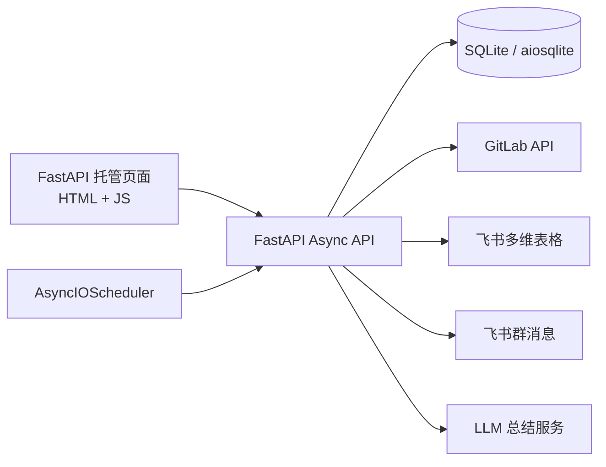
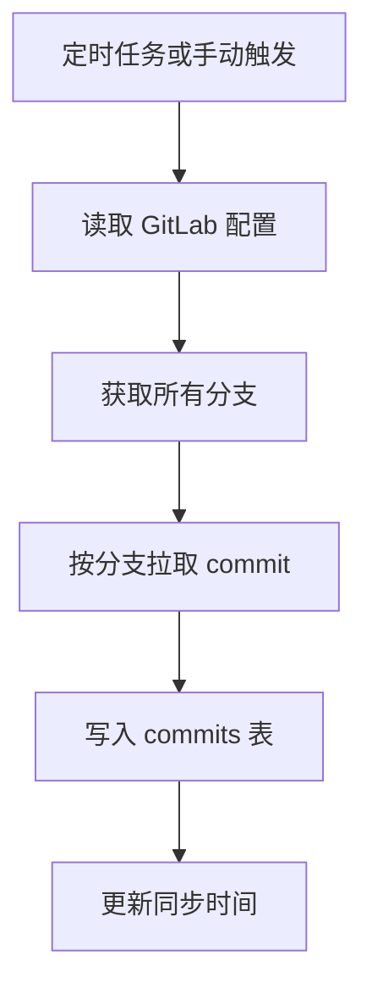
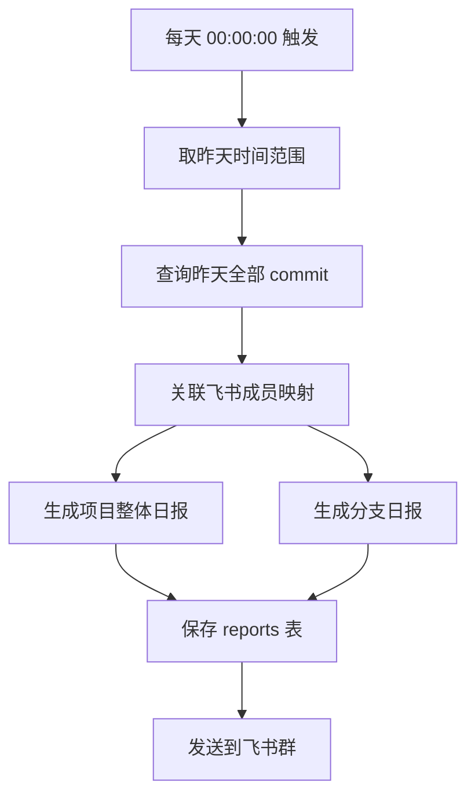
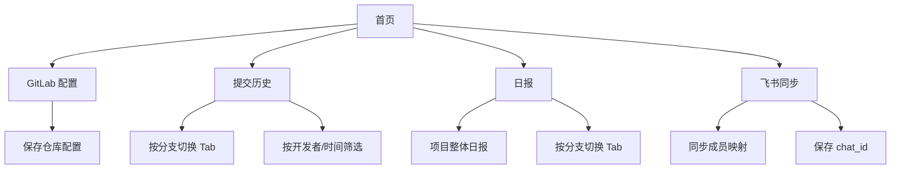

# Git Progress Tracker MVP

## 1. 当前目标

这个项目当前只做一件事：跑通一个可用的 MVP。

MVP 的目标是：

- 跟踪 1 个指定 GitLab 仓库
- 拉取该仓库所有分支的 commit
- 在页面中查看分支 commit 历史并筛选
- 每天 `00:00:00` 基于昨天的 commit 生成项目整体日报和分支日报
- 从飞书多维表格同步成员映射
- 将日报发送到手动指定的飞书群

固定约束：

- 后端：FastAPI
- 所有接口和内部 I/O 方法：异步
- 前端：原生 HTML + JS，由 FastAPI 托管
- 数据库：SQLite 文件，放在项目目录内
- 时区：`Asia/Shanghai`

## 2. 明确范围

### 2.1 本期要做

- 只支持 1 个 GitLab 仓库
- 跟踪所有分支
- 只采集 commit，不采集 MR、Issue、Comment
- 飞书群通过手动填写方式配置
- 飞书多维表格字段先固定为：
  - 开发者姓名
  - GitLab 用户名
  - 负责组件

### 2.2 本期不做

- GitHub 支持
- 多仓库
- 自动选择飞书群
- 项目说明文件上传或解析
- 飞书卡片消息
- MR / Issue / Comment 分析

## 3. 架构总览

核心模块：

- `Web UI`
  - 托管配置页、提交历史页、日报页、飞书同步页
- `Async API`
  - 提供配置、查询、同步、手动触发日报等接口
- `GitLab Sync`
  - 拉取所有分支的 commit 并落库
- `Report Service`
  - 聚合昨日 commit，生成项目整体日报和分支日报
- `Feishu Service`
  - 同步多维表格成员信息
  - 发送日报到指定群
- `Scheduler`
  - 定时拉取 commit
  - 定时同步成员信息
  - 定时生成并发送日报

## 4. 核心流程

### 4.1 Commit 同步流程

说明：

- 所有分支都要同步
- commit 默认按时间倒序存储和展示
- 同步时要避免重复写入

### 4.2 日报生成流程

说明：

- 日报统计范围固定为昨天 `00:00:00` 到 `23:59:59`
- 每天的日报需要先给出整个项目的整体进度总结
- 在整体总结之后，再给出按分支拆分的日报内容
- 日报中需要体现提交人、组件和主要进展

### 4.3 页面交互结构

## 5. 页面设计

### 5.1 GitLab 配置页

用于配置唯一仓库。

字段建议：

- GitLab Base URL
- Personal Access Token
- Project ID 或 `group/project`
- 同步时间间隔（分钟）

操作：

- 保存配置
- 测试连接
- 手动执行一次同步

### 5.2 提交历史页

展示所有分支的 commit 历史。

规则：

- 按分支分 Tab
- 每个 Tab 默认按时间倒序
- 默认先展示最新一页
- 提供筛选条件：
  - 开发者
  - 开始时间
  - 结束时间

每条 commit 显示：

- 提交时间
- 分支名
- 提交者
- commit message
- commit sha
- GitLab 链接

### 5.3 日报页

展示已生成的日报。

规则：

- 页面顶部先展示项目整体日报
- 下方按分支分 Tab 展示分支日报
- 默认按日期倒序
- 项目整体日报显示：
  - 日期
  - 项目整体进度总结
  - 活跃开发者汇总
  - 组件进展汇总
  - 风险或需要关注的事项
- 分支日报显示：
  - 日期
  - 分支名
  - 摘要内容
  - 发送状态
  - 创建时间

操作：

- 查看历史日报
- 手动触发生成昨日日报
- 手动重发某条日报

### 5.4 飞书同步页

用于配置飞书连接并同步成员映射。

字段建议：

- App ID
- App Secret
- 多维表格 App Token
- Table ID
- 群 `chat_id`

成员表固定字段：

- 开发者姓名
- GitLab 用户名
- 负责组件

操作：

- 保存飞书配置
- 测试飞书连接
- 同步成员信息
- 测试发送消息

## 6. 数据模型

### 6.1 `app_settings`

保存全局配置。

建议字段：

- `id`
- `gitlab_base_url`
- `gitlab_token`
- `gitlab_project_ref`
- `sync_interval_minutes`
- `timezone`
- `feishu_app_id`
- `feishu_app_secret`
- `feishu_bitable_app_token`
- `feishu_bitable_table_id`
- `feishu_chat_id`
- `created_at`
- `updated_at`

### 6.2 `branches`

保存 GitLab 分支信息。

建议字段：

- `id`
- `name`
- `is_default`
- `last_synced_at`

### 6.3 `commits`

保存所有分支的 commit。

建议字段：

- `id`
- `branch_name`
- `commit_sha`
- `author_name`
- `author_email`
- `committed_at`
- `title`
- `message`
- `web_url`
- `raw_payload`
- `created_at`

约束建议：

- `branch_name + commit_sha` 唯一

### 6.4 `contributors`

保存从飞书多维表格同步的成员映射。

建议字段：

- `id`
- `name`
- `gitlab_username`
- `component`
- `feishu_record_id`
- `is_active`
- `created_at`
- `updated_at`

### 6.5 `daily_reports`

保存项目整体日报和分支日报。

建议字段：

- `id`
- `report_date`
- `report_type`
- `branch_name`
- `content`
- `status`
- `sent_at`
- `created_at`

说明：

- `report_type` 取值建议为 `project` 或 `branch`
- 当 `report_type=project` 时，`branch_name` 为空
- 当 `report_type=branch` 时，`branch_name` 为具体分支名

建议状态：

- `draft`
- `sent`
- `failed`

## 7. API 草案

### 7.1 配置相关

- `GET /api/settings`
- `POST /api/settings/gitlab`
- `POST /api/settings/feishu`
- `POST /api/settings/test-gitlab`
- `POST /api/settings/test-feishu`

### 7.2 同步相关

- `POST /api/sync/branches`
- `POST /api/sync/commits`
- `POST /api/sync/feishu-contributors`

### 7.3 提交历史

- `GET /api/branches`
- `GET /api/commits`

查询参数建议：

- `branch`
- `author`
- `date_from`
- `date_to`
- `page`
- `page_size`

### 7.4 日报

- `GET /api/reports`
- `GET /api/reports/project-daily`
- `POST /api/reports/generate-daily`
- `POST /api/reports/{report_id}/send`

## 8. 调度设计

固定时区：`Asia/Shanghai`

建议任务：

- commit 同步：每 15 分钟一次
- 飞书成员同步：每天 23:50 一次
- 日报生成并发送：每天 00:00:00 一次

说明：

- 所有定时任务都运行在同一个 FastAPI 进程内
- 当前是单机 MVP，这个方案足够

## 9. 技术选型

- FastAPI
- SQLAlchemy Async
- `sqlite+aiosqlite`
- httpx AsyncClient
- APScheduler AsyncIOScheduler
- 原生 HTML + JS

实现原则：

- 所有路由使用 `async def`
- 所有数据库访问走异步 Session
- 所有外部 HTTP 调用走异步客户端
- 页面由 FastAPI 提供静态资源或模板渲染

## 10. 输出结果要求

日报内容至少应包含：

- 日期
- 项目整体进度总结
- 活跃开发者汇总
- 组件进展汇总
- 风险或需关注事项
- 分支名
- 当日主要提交概述
- 提交人
- 组件归属

commit 列表页至少应支持：

- 按分支查看
- 按开发者筛选
- 按时间筛选
- 时间倒序分页

## 11. 当前结论

当前项目是一套单机、异步、以 FastAPI 为核心的 GitLab commit 跟踪系统。

它的最短闭环是：

1. 配置 GitLab 和飞书
2. 同步所有分支 commit
3. 在页面中查看 commit 历史
4. 每天自动生成项目整体日报和分支日报
5. 将日报发送到指定飞书群
